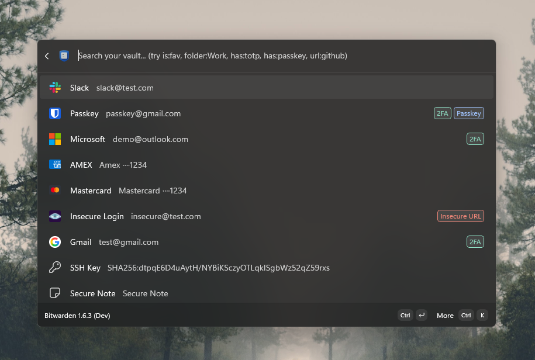

# Command Palette Extension for Bitwarden

A free, open-source [PowerToys Command Palette](https://learn.microsoft.com/windows/powertoys/command-palette/) extension for Bitwarden. Instant credential search and copy, directly from your keyboard.

Built as an alternative to 1Password Quick Access after their unjustified price increases. Same experience, powered by your Bitwarden vault.

[![Get it from Microsoft Store](https://img.shields.io/badge/Microsoft%20Store-Install-0078D4?style=for-the-badge&logo=data:image/png;base64,iVBORw0KGgoAAAANSUhEUgAAACAAAAAfCAYAAACGVs+MAAAABGdBTUEAALGPC/xhBQAAACBjSFJNAAB6JgAAgIQAAPoAAACA6AAAdTAAAOpgAAA6mAAAF3CculE8AAAACXBIWXMAAA7DAAAOwwHHb6hkAAAABmJLR0QA/wD/AP+gvaeTAAAAB3RJTUUH6QsSCzAeWUOqngAAACV0RVh0ZGF0ZTpjcmVhdGUAMjAyNS0xMS0xOFQxMTo0ODozMCswMDowMGw9ckYAAAAldEVYdGRhdGU6bW9kaWZ5ADIwMjUtMTEtMThUMTE6NDg6MzArMDA6MDAdYMr6AAABh2lUWHRYTUw6Y29tLmFkb2JlLnhtcAAAAAAAPD94cGFja2V0IGJlZ2luPSfvu78nIGlkPSdXNU0wTXBDZWhpSHpyZVN6TlRjemtjOWQnPz4NCjx4OnhtcG1ldGEgeG1sbnM6eD0iYWRvYmU6bnM6bWV0YS8iPjxyZGY6UkRGIHhtbG5zOnJkZj0iaHR0cDovL3d3dy53My5vcmcvMTk5OS8wMi8yMi1yZGYtc3ludGF4LW5zIyI+PHJkZjpEZXNjcmlwdGlvbiByZGY6YWJvdXQ9InV1aWQ6ZmFmNWJkZDUtYmEzZC0xMWRhLWFkMzEtZDMzZDc1MTgyZjFiIiB4bWxuczp0aWZmPSJodHRwOi8vbnMuYWRvYmUuY29tL3RpZmYvMS4wLyI+PHRpZmY6T3JpZW50YXRpb24+MTwvdGlmZjpPcmllbnRhdGlvbj48L3JkZjpEZXNjcmlwdGlvbj48L3JkZjpSREY+PC94OnhtcG1ldGE+DQo8P3hwYWNrZXQgZW5kPSd3Jz8+LJSYCwAAA+VJREFUWEe9lk+IG1Ucx7+/9yaZJJttdrfZuGpbXIIBsSAIPRU8CBa9qRcVRPQoLD15UPBW8VCqV716KuTmpUjFIt6EQLEeKouwsGx2kh15k2xsk8nMez8PSdjZl2wm/bN+4HvIm+/75fve+71hgEekXq9nlVJXlVL3u90uB0HAQRD8qZTaqtfrWdufBtkD89jZ2XlpbW3tZyFEod/vf9Pr9W7ncrlzruu+k81mP2TmplLqyubm5n177kksHKDT6awS0d/MfHdlZeVKo9FYrtVq14gor7W+0+l0Dkql0ldCiKoxphaGobuxsdG26zw2nud9p5RSAGh3d/fS4eHhIAiC7/f29s5OPI1Go9Dtdnv7+/vX2+32K57nvXe8ymOyvb3ttlqtB81mcwsAfN/vHBwc/GD7AKDZbH7heV7PGOO2Wq1bvu8/Z3uSCHtgFsVicUNKWWDm2+12+00pZanX6121fQAgpfzVcZyi7/sZABxF0Qe2J8lCAaIoiowxICLFzK8NBoM/qtVq1/YBgDGmq7VGpVIJATwkoldtTxLyPO+iPWgjpTzPzLe01m8B+ISIXgTwke0bc5GIbhLRZWa+xswSwJZtmkC+77M9aMPMMMZACAFmBjNDiJM3L+kFACIC0ewLJyYF58lmUnCWTsKuORG1Wq3pf/gfWSAAAxkXEBJI7gYROB5CaoIUWSSLEADDGpoHqe+69AAkQEEb1H8AJM/daODMOh7mNfpD/9j2MxhZsYRi5nkwzNGcGaQEIHB+Cbkbn8L5/SdwYfnoSa8D+fF13Ln8D37763PknaNZoQZqq2/g7eqPGOreaBdP4ORWTsJmtGJbzGAwmEenc0wpK5+wWAASox6wRQQCgQjTWrD0Yq5TZLEAcQQMB8AwTGgA0hoGMWKDKWkept4ALBSADTJnn4F7vgr33AtHulAFLReRE2WsFWpYtVTMboKh7WpTpNwCQBBw0DcYxHx8QQyccR2syAAcBYkHY0QBnHkWSGnGuQEIwLIDvHvXxS8tCWQSD4eEz14u4uulL4Gdb4HENYQGhiuvQ1XrIP3vk1/DYWwQRXpKsQHAQ0D3p8Sm/5R6AICkcS1Lo8lianwkaZeZyUIBTpOFAkRm3EuWYgbA8eg3J2QA4sguM5PUAAxg3QUqeUYll1CeUXIMjCzBuBWYTEJuBdpZn9t8E+beAoyPc2AAPcOVEYQshsCs1ZIEUy41RGoAjJtQkFWLRqE0C9DMhjMAL/AiUkpxGIZzP6dOA2aG67oQYRjeK5fLAOZ/6z1NAUC5XEYURfdIKXXBcZybcRxfCsNQEFHqkTwJzEyu6xohRMMY8/5/UhUwwGPTYBoAAAAASUVORK5CYII=)](https://apps.microsoft.com/detail/9P5KS8T80MV3)
&nbsp;&nbsp;&nbsp;&nbsp;
[](https://github.com/hoobio/command-palette-bitwarden/releases/latest)
&nbsp;&nbsp;&nbsp;&nbsp;
[](https://www.paypal.com/donate/?hosted_button_id=E2UBLTYAT4K8Y)

---

[](https://github.com/hoobio/command-palette-bitwarden/actions/workflows/build.yaml)
[](https://github.com/hoobio/command-palette-bitwarden/actions/workflows/codeql.yml)
[](LICENSE)
[](https://github.com/hoobio/command-palette-bitwarden/stargazers)
[](https://github.com/hoobio/command-palette-bitwarden/issues)
[](https://github.com/hoobio/command-palette-bitwarden/commits/main)



## Features

- **Vault search** with fallback suggestions across all item types
- **Secure clipboard**: passwords excluded from clipboard history, auto-cleared on a configurable timer
- **Smart sorting**: recently used, favorites, and context-matched items float to the top
- **TOTP display**: live codes with countdown timers
- **Search filters**: prefix syntax like `is:fav`, `folder:Work`, `has:totp`, `url:github`
- **Watchtower tags**: visual warnings for weak, old, or reused passwords
- **Context awareness**: detects open apps and browser tabs to surface relevant items
- **Custom field copy**, **SSH quick-connect**, **manual vault sync**, and more

> **📖 [Full documentation on the Wiki](../../wiki)**: [search filters](../../wiki/Search-and-Filtering), [context awareness](../../wiki/Context-Awareness), [clipboard security](../../wiki/Clipboard-Security), [settings](../../wiki/Settings), and [item actions](../../wiki/Vault-Item-Actions).

## Prerequisites

- **Windows 10 (19041+)** with [PowerToys Command Palette](https://learn.microsoft.com/windows/powertoys/command-palette/) enabled
- **[Bitwarden CLI](https://bitwarden.com/help/cli/)** (`bw`) on your `PATH`

## Installation

### Microsoft Store

**[Get it from the Microsoft Store](https://apps.microsoft.com/detail/9P5KS8T80MV3)** for automatic updates.

> The Store version may lag behind GitHub Releases due to Microsoft's certification process. Install from GitHub if you need the latest version immediately.

### GitHub Releases

1. Download the `.msix` for your architecture (x64 or ARM64) from [Releases](../../releases)
2. Install the signing certificate ([`HoobiBitwardenCommandPaletteExtension.cer`](HoobiBitwardenCommandPaletteExtension.cer)) to the **Trusted People** store:
   - Double-click the `.cer` file → **Install Certificate** → **Local Machine** → **Trusted People** → Finish
   - Or via PowerShell (admin):
     ```powershell
     Import-Certificate -FilePath .\HoobiBitwardenCommandPaletteExtension.cer -CertStoreLocation Cert:\LocalMachine\TrustedPeople
     ```
3. Double-click the `.msix` to install, or:
   ```powershell
   Add-AppxPackage -Path .\HoobiBitwardenCommandPaletteExtension_x64.msix
   ```

### From Source

```powershell
git clone https://github.com/your-username/hoobi-bitwarden-command-palette.git
cd hoobi-bitwarden-command-palette/HoobiBitwardenCommandPaletteExtension
dotnet build -c Debug -p:Platform=x64
```

## Usage

1. Open the Command Palette (`Win + Ctrl + Space`)
2. Type **"Bitwarden"** to open the vault browser, or just start typing. Matching items appear as fallback results
3. If your vault is locked, you'll be prompted for your master password
4. Click an item for its default action, or open the context menu for more options

## Security

- Master passwords are passed to the Bitwarden CLI via **environment variables**, not command-line arguments
- Session keys are stored in **Windows Credential Manager** when "Remember Session" is enabled
- Sensitive clipboard data (passwords, TOTP, card numbers) is excluded from Windows clipboard history and auto-cleared
- Vault cache is **in-memory only**, cleared on lock/exit
- No vault data is written to disk (only access timestamps for sorting)
- All search input is **regex-escaped** before use

## Building

```powershell
# Debug
dotnet build -p:Platform=x64

# Release
dotnet publish -c Release -p:Platform=x64
```

## License

[MIT](LICENSE)
